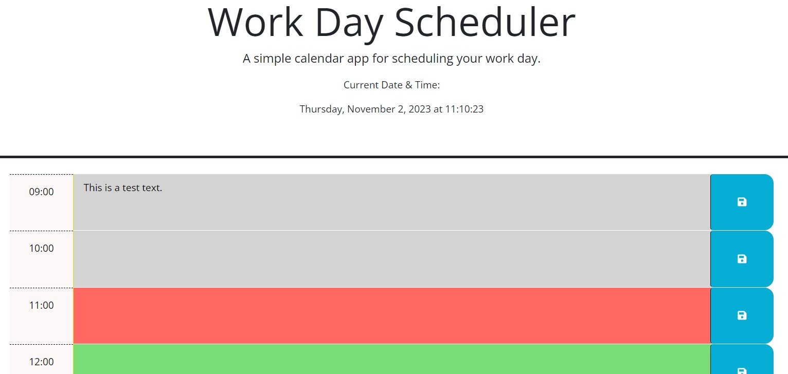

# Third Party APIs (Work Scheduler)
## Description

The deployed site was created to combine the use of JavaScript and JQuery coding to create an interactive 'work scheduler' to help organise the working day.

The index.html and style.css files were taken from existing code and the JS file was created from blank.
The JavaScript was adapted from previous code I have written, and from anonymous instructions on websites such as w3schools.com. 
The code was adapted, re-written or changed to create the functionality to match the below acceptance criteria.

It follows the user story and acceptance criteria detailed below.

## User Story

```
AS AN employee with a busy schedule
I WANT to add important events to a daily planner
SO THAT I can manage my time effectively
```

## Acceptance Criteria

```
GIVEN I am using a daily planner to create a schedule
WHEN I open the planner
THEN the current day is displayed at the top of the calendar
WHEN I scroll down
THEN I am presented with timeblocks for standard business hours of 9am to 5pm
WHEN I view the timeblocks for that day
THEN each timeblock is color coded to indicate whether it is in the past, present, or future
WHEN I click into a timeblock
THEN I can enter an event
WHEN I click the save button for that timeblock
THEN the text for that event is saved in local storage
WHEN I refresh the page
THEN the saved events persist
```

## Installation
```
n/a
```
## Usage
```
Please find the source code located here in repository: 
https://github.com/MagMillen-Dutka/UBHM-05-Third-Party-API-02-Challenge

Deployed website can be found here: 
https://magmillen-dutka.github.io/UBHM-05-Third-Party-API-02-Challenge/


Screenshot:



```
## Credits
```
n/a
```
## License
```
For licensing details please see "LICENSE" details within the repository.

MIT License is used for this project.
```
